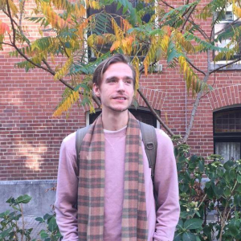

Stan Guldemond
==============

Full stack developer with a passion for creating easy to use, scalable, readable, problem solving software
------------------------------------

* <stanguldemond@gmail.com>
* +31625405664
* Amsterdam, The Netherlands
* [LinkedIn](https://www.linkedin.com/in/stan-guldemond-56291b120/), 
[GitHub](https://github.com/sguldemond/),
[GitLab](https://gitlab.com/users/stanguldemond/contributed),
[Stackshare](https://stackshare.io/sguldemond)

----

Stack
-----

- Python 3, [Flask](https://flask.palletsprojects.com/), [FastAPI](fastapi.tiangolo.com/), [SQLAlchemy](https://www.sqlalchemy.org/), [aio-pika](https://pypi.org/project/aio-pika/), [typing](https://docs.python.org/3/library/typing.html), [pytest](https://docs.pytest.org), PEP 8, virtual environments
- PostgreSQL, [PostGIS](https://postgis.net/), (materialized) views, indexes, [pgAdmin](https://www.pgadmin.org/)
- Docker, docker-compose, Docker networks
- Linux, Ubuntu Desktop & Server, Git, bash, zsh, shell script, crontab
- GitLab CI/CD pipelines
- RabbitMQ, Nginx, Celery, VueJS, Node, VSCode, PyCharm, Git Flow

----

Experience
----------

2018-now: **Full Stack Developer** // CTO Innovatieteam, City of Amsterdam (Amsterdam, The Netherlands)

    Currently developing human centric tools, with a data driven approach, supporting the maintenance of the public space in Amsterdam. Working in a self managed multi disciplinary team with a focus to make things work, see 'Projects'.

    Previous activities include:
    - Designing + developing an Attribute Based Digital Identity prototype with a focus on data ownership and zero knowledge proof as part of the European Commission funded Decode program.
    - Maintaining & expending our infrastructure capabilities using Gutter (see Projects).

2017: **Software Engineer** // Ceron IT Solutions (Vught, The Netherlands)

    - Developing and maintaining web application with Java EE backend
    - Implementing PrimeFaces framework frontend 

2016: **Student Assistent** // Fontys University of Applied Sciences (Eindhoven, The Netherlands)

    Assisting part-time students, between the ages of 25 and 50, twice a week in the subject of object oriented programming focussing on the basics of programming in C# and software design. 

2016: **Teacher** // SintLucas (Eindhoven, The Netherlands)

    Part of my bachelor's degree in software engineering. I got to teach young adults the basics of object oriented programming in C# and assist them in various other skills. 

----

Education
---------

2015-2019: **Bachelor's Degree, Software Engineering** // Fontys University of Applied Sciences (Eindhoven, The Netherlands)

    With software engineering I've learned to design software in an efficient and maintainable way. Next to this main focus I've had a introduction into teaching young adults and a introduction into designing software for mobile devices.

2011-2013: **Applied Psychology** // Fontys University of Applied Sciences (Eindhoven, The Netherlands)

    Learning about the working of the human mind, conversation techniques and analysing social issues. Initiated a study group with classmates.

2007-2011: **MBO BOL-4, Graphic Design** // Grafisch Lyceum Rotterdam (Rotterdam, The Netherlands)

    Graphic Design, Adobe Creative Suite, Desktop Publishing

----

Projects
--------

**Object Detection Kit**: Open source object recognition tool for municipalities to spot misplaced garbage in the streets and act on it quickly, even before citizens notice. My role and responsibilities:

    - Lead developer: Code reviews, architecture design, communication with stackholders, user tests, hiring new developers, documentation
    - Development: Python, VueJS, PostgreSQL
    - DevOps: GitLab CI, docker-compose, Ubuntu Server
    - Hardware: Maintanence GPU servers for image recognition

- [Project website](https://www.odk.ai)
- [Open source repository](https://www.gitlab.com/odk/odk-stack)
- [All ODK projects](https://www.gitlab.com/odk) 

**Decode Digital Identity**: Prototype for attribute based digital identity utilizing the data on a NFC readable passport. The different elements of this project I created:

    - Passport scanner: Controlling NFC reader, camera and display using Python
    - Mobile app: VueJS PWA
    - Backend: Python Flask, Zenroom

This project made money avaliable for continues research and development of the use of digital identity in the City of Amsterdam.

- [Me presenting the project in Turin, Italy](https://www.vimeo.com/384562767)
- [GitHub repository](https://www.github.com/Amsterdam/decode_passport_scanner)
- [Quick demo](https://www.youtube.com/watch?v=p1KLvwV7oIM)
- [Decode Project](https://www.decodeproject.eu)

**Gutter**: Python based API generator, with build in ETL tooling, real time analytics, message queuing and more utilizing the power of PostgreSQL.

    Build an analytics engine using Celery workers. It scheduled analytics jobs (Python pandas) and persisted the output data in a database (PostgreSQL) then automatically generated and deployed REST APIs (Flask). think Apache Airflow x Google Firebase.

- [Outdated repository](https://www.github.com/amsterdam/gutter)

----

Miscellaneous    
-------------

**Languages**:

- Dutch (mother tongue)
- English (professional, daily speaker)
- Polish (beginner)

**Hobbies**

- Linux, coding useful tools for myself
- Climbing, bouldering, long distance cycling, yoga, camping
- Spirituality, mental health, films, music, reading, writing, drawing

----